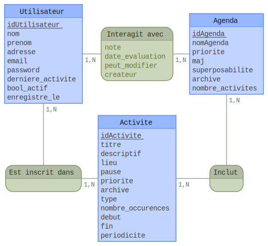

# _Rapport du **projet de Base de données, part 1?**_

[par LEDDA Damien & DURAN Mike]

## **Modèle conceptuel & logique**

### Modèle Entité-Association

Ce modèle, centré sur 3 tables principales (`Online_Users`, `agendas` et `activite`), 2 tables d'archives et 3 liaisons (`Online_Users_agendas`, `Online_Users_activite` et `agendas_activite`), représentera la base de données (en cours) des agendas. Voyons de plus près ces tables ...

* `Online_Users` : cette table associe un `idOnline_Users` à tel.le utilisateur/trice au `nom` et `prenom` qu'il/elle a pris soin de renseigner lors de son inscription, avec son `email`, son mot de passe (`password`) -- qui est **en clair** comme les plages du midi et de début de soirée d'une chaîne à péage pour l'instant, la fonction de hashage arrivera peut-être -- et son `adresse`. **Le fait qu'il/elle soit actif/ve ou non -- ce qui le/la fera transférer dans une des deux tables sur l'activité de l'utilisateur -- sera déterminé par la date de dernière activité (`derniere_modification`) se trouvant dans les deux sous-tables**. Lors de son inscription, la variable `enregistre_le` lui sera assigné automatiquement à la valeur de `sysdate` enregistrée au même moment.\
  &rArr; Elle représentera **l'utilisateur du site d'agendas**. Tous ces attributs sont non nuls. Les dates d'activité et d'inscription seront par défaut sur **`sysdate`**.

* `activite` : Elle représentera **l'évènement que l'utilisateur veut créer (ou s'inscrire) sur l'agenda**. Non seulement elle associera cette `activite` à un `idActivite`, mais elle en donnera aussi une `priorite`, un `titre`, un `descriptif` et son `type_activite` (sa catégorie, juste au cas où). Cependant, l'utilisateur n'est pas obligé de donner un lieu (`geographie`) s'il veut que son `activite` soit une chasse au trésor ... ou à l'évènement, dans ce cas. Il aura aussi la possibilité de dire si c'est une pause -- via le booléen `bool_pause`. Elle aura obligatoirement un `debut`, mais pas nécessairement de `fin`, en plus de sa `periodicite` -- si c'est hebdomadaire, mensuel, quotidien ... -- et son nombre d'occurences `nbOccurences`.

* `agendas` : Contenant son `idAgenda`, son nom, sa date de `mise_a_jour`, sa `priorite`, sa possibilité d'être superposable (`bool_superpose`) et son état (`bool_passe`), l'agenda servira de **"schedule" pour différentes `activite`s inscrites par l'utilisateur**. Il pourra en créer, en ajouter, ... et s'il en a la permission, la modifier.

* Eh oui, l'utilisateur est lié à l'agenda du fait que la permission de modifier l'agenda (`bool_modifier`) -- bien sûr, il aura automatiquement le droit s'il en est le créateur (si `idCreateur` = `idOnline_Users`) et la note donnée (`evaluation` et son timestamp `evalue_a`) diffère selon l'agenda auquel il s'est inscrit !

* Evidemment, un agenda peut regrouper plusieurs activités. D'où la table de liaison `agendas_activite`.

* L'utilisateur sera aussi lié à l'`activite`: il se peut qu'il y ait plusieurs personnes pour un seul et même évènement.

**Nota bene**: les id*Table* sont auto-incrémentés par des **séquences**.

### Modèle logique relationnel

## **Contraintes d'intégrité**

Toutefois, il existera des **contraintes** à cette base. Entre autres :

* L'utilisateur _doit_ donner un `username`, un `email`, un mot de passe et ses coordonnées personnelles pour s'inscrire. **Il ne pourra pas s'inscrire tant que l'un de ces critères n'est pas rempli.** *(On n'est pas un peu gourmands en termes de vie privée à ce point ?)*
* Pour déterminer si un utilisateur est actif, **il faut qu'il ait modifié -- ou créé? -- un agenda il y a moins de 3 mois à compter de... MAINTENANT.** Sinon, il sera **inactif**.
* L'`activite` _doit_ avoir un `titre`, une `description` et un `type` pour plus d'efficacité (et de monde) dans son évènement qu'il promouvoit. Ah, et aussi un `debut` à cet évènement, sinon, ça ne servirait à rien. *Et de préférence une `fin`, si jamais cet évènement ne veut pas durer 4 milliards d'années. Bien sûr, __on va éviter les paradoxes temporels.__*
* Si on a une `fin`, l'`activite` _doit_ spécifier sa `periodicite`. Sinon, son nombre d'occurences.
* Si un utilisateur veut donner une `evaluation` à un agenda, elle _doit_ être comprise entre **1** et **5**. *Sinon, avez-vous déjà vu une application notée __-1/5__ ou __300/5__ sur le Store de votre OS ? (Parce que nous non.)*
